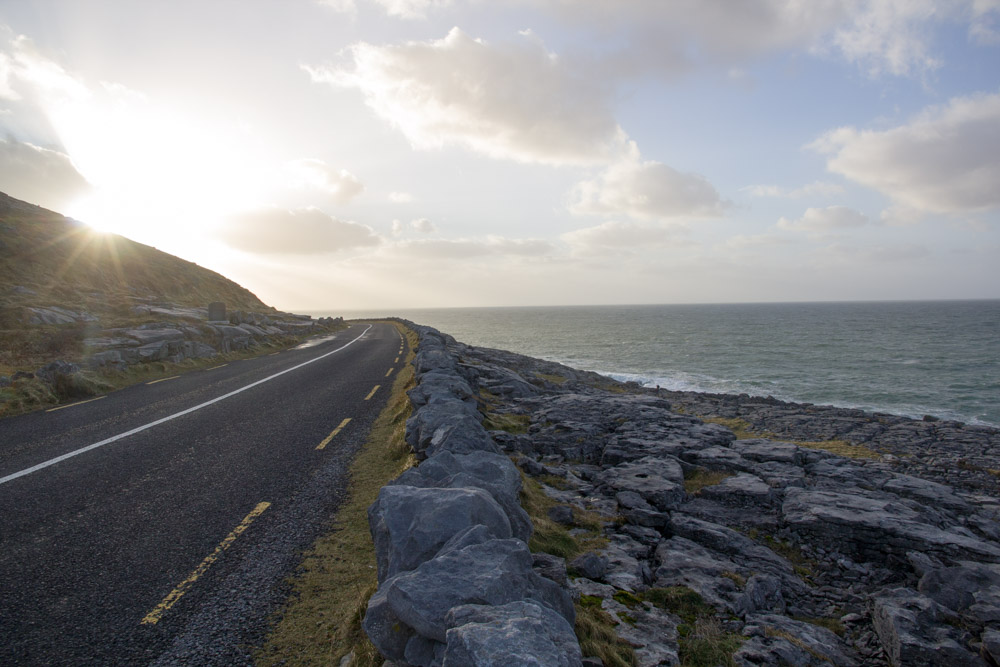
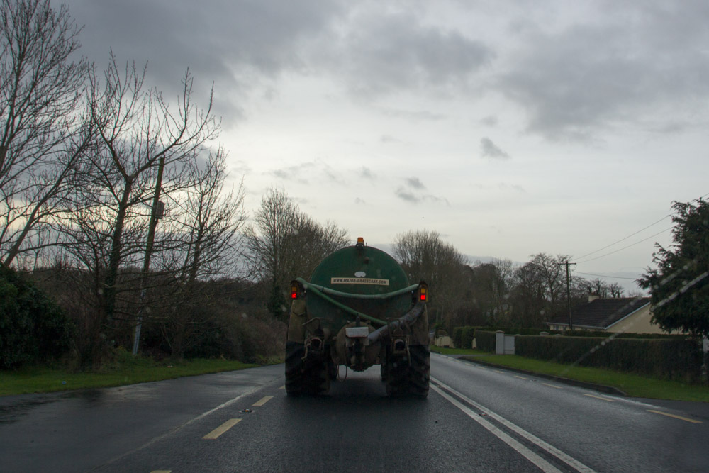
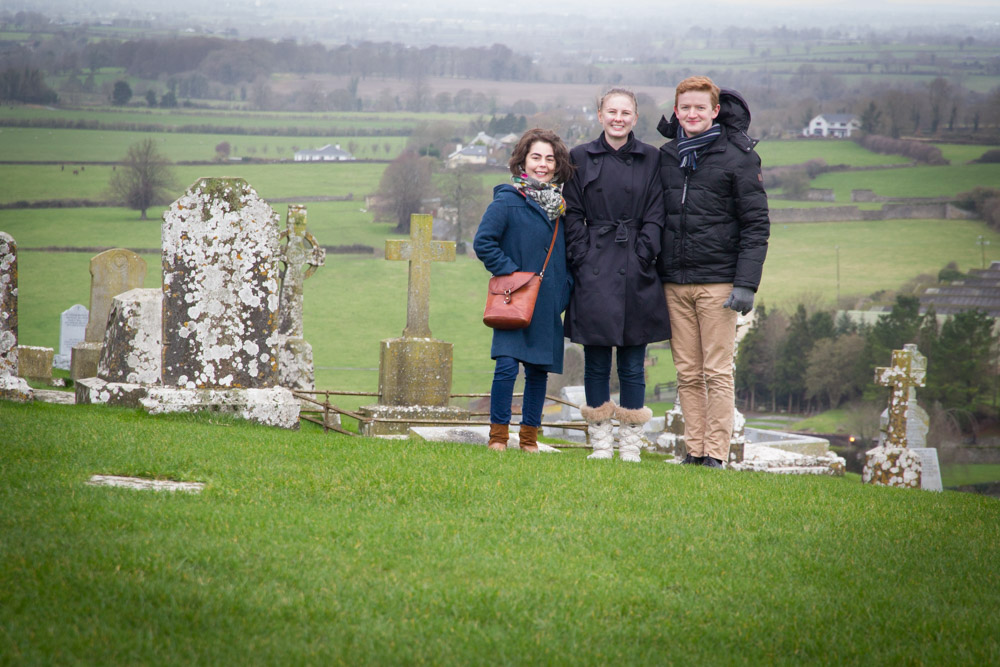
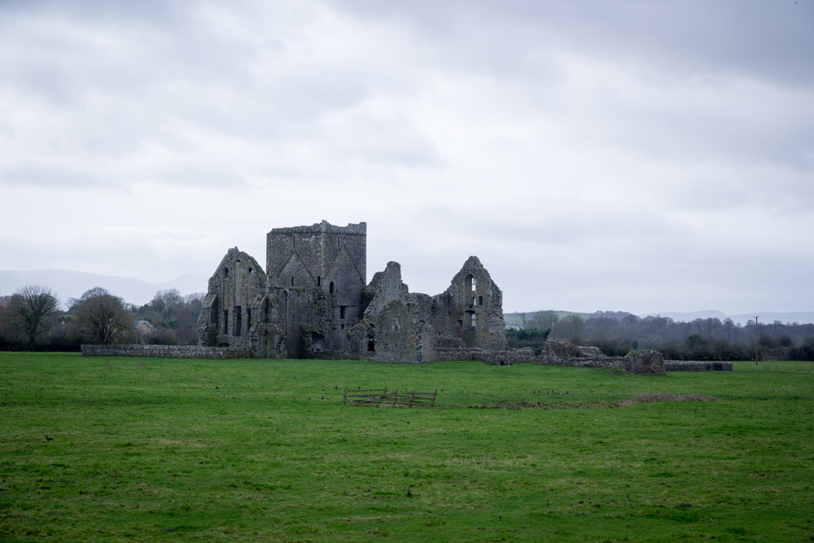
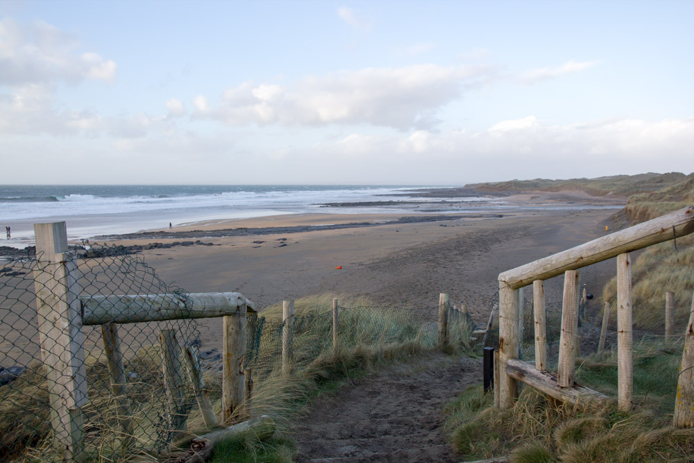
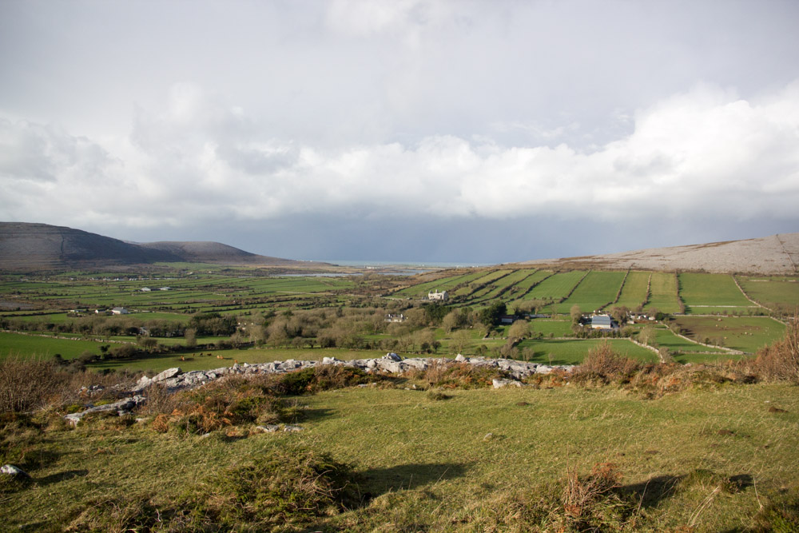
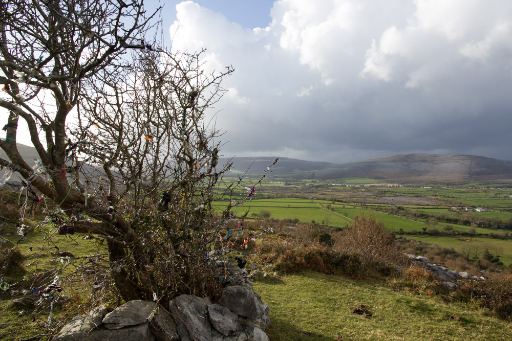
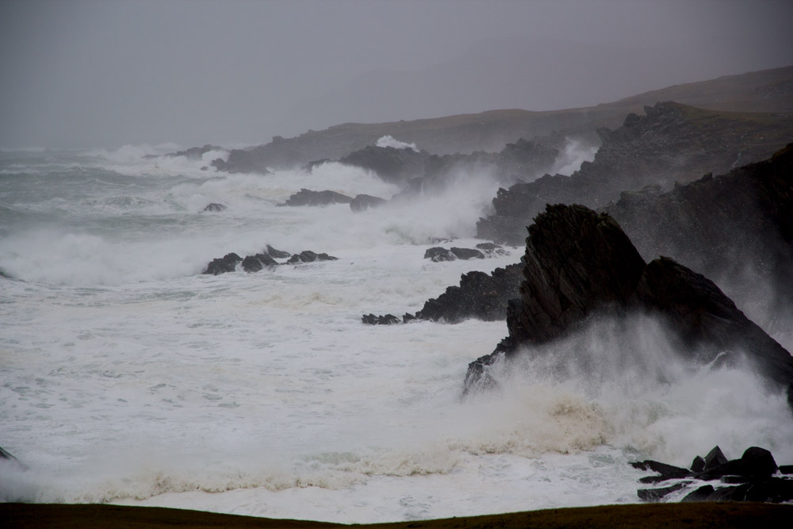
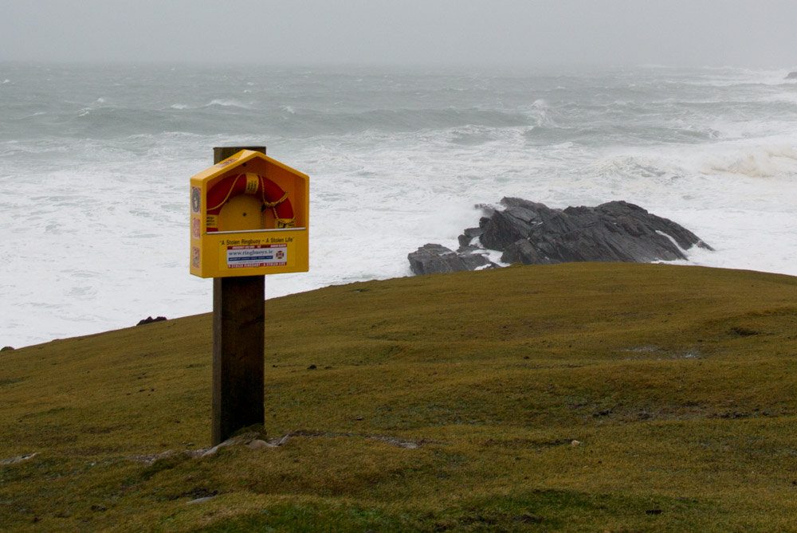
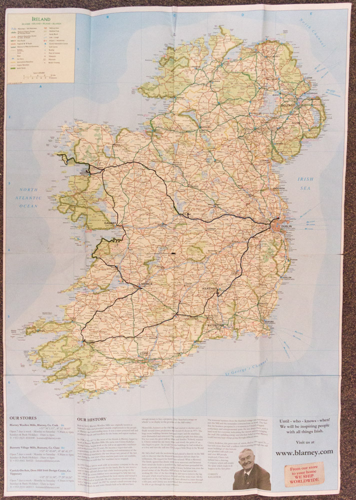

**Day 1 & 2: Dublin - Kilkenny**

Landing in Dublin was eventful. The wind meant the plane was thrown around like a rag doll with wings all the way down. After surviving the descent and getting our bags, we met up with our friend Bronte, who was on exchange in Glasgow. She was taking a couple of days off before returning to Glasgow for exams. Then it was time for hire car number 2. Our steed for the next 6 days was to be a <del>pink</del>&nbsp; wine-coloured, Nissan Micra. It was like driving a peanut after the Audi we had in Germany.

We drove straight to our B&B just outside Kilkenny, a 1.5 hour journey that ended up taking 2.5 hours with the poor weather and my need for snacks. After checking in to our B&B we made our way back into the city for dinner with Gen's Irish relatives. Bronte holed up in a nearby pub nearby to do some study while Gen and I got lost trying to find the restaurant. With an almost-flat phone, no wifi or data, and only a vague (wrong) recollection of where we were going, it took forever to find the restaurant, but we got there in the end! Gen was expecting two, maybe three people tops, but the entire family turned out! We had a fantastic dinner.

The next morning we awoke to a rare sunny Irish day, enjoyed the first of the incredible Irish breakfasts and headed back into Kilkenny. We toured Kilkenny Castle (with a large group of Russian school students) where the National Trust has done a great restoration job. The tour guide talked us through the history of the Butlers (the main family who lived there).

After our history-filled morning, we saw Penguins of Madagascar for some comedic relief before eating dinner at a local pub, complete with live folk music.

**Day 3: Kilkenny - Killarney**

After another amazing breakfast we checked out and started the long drive to Killarney, made only slower by tractors on the winding Irish roads. Our first stop for the day was Cashel, where we spent a couple of hours exploring the Rock of Cashel, an imposing ruined castle and cathedral on top of a hill whose only inhabitants are crows (or jackdaws?). Perched upon a bare hill (or rock?) the Rock of Cashel was commanding. Unfortunately we missed out on learning most of its history as the tour was after we had to be back on the road.

After exploring the castle, we strolled down to explore the ruins of a wild and rugged looking abbey - Hore Abbey.

Bronte then made her way back to Glasgow via Dublin, and we drove on to Killarney! We checked into our AirBnB and found a delicious dinner at a local pub.

**Day 4: Killarney - Galway**

Our trip to Galway was a long one. A decent breakfast and postcard hunt was followed by 1.5 hours to Limerick, where we planned to stop for a light lunch. However, the size of the city defeated us and we decided to continue on. Still hungry, we stopped at Ennis and wandered down the quaint streets until we found a great little cafe. Then it was on to the Cliffs of Moher. We decided not to stop at the tourist trap and instead drove down the coastal road - the Wild Atlantic Way - by far my favourite part of the entire Ireland trip! It was an incredible drive, and the Wild Atlantic Way definitely lived up to its name.

         <iframe width="560" height="315" src="https://www.youtube.com/embed/1JrdFaYx8VU" frameborder="0" allowfullscreen></iframe>

 
All the houses along the coast are hunkered down against the regular wind and storms that come over the ocean. The weather was rough, making the Atlantic look powerful and savage. We took a detour down to Doolin Pier, where the ferries depart, and got up close (well, not too close) and personal with the ferocity of the waves. The weather was so bad that none of the ferries were running, answering our question for how boats would be able to survive in such harsh weather!

We continued down the coastal road, passing a lighthouse perched on a rock, cows on the cliffs, and what passes for an Irish beach. It was windy, cold and miserable, although it might be alright in summer. Not quite up to the Australian standard of beach.

An hour's driving (plus many stops) saw us at our next AirBnB, a quirky house and garden owned by an artist. For the first time we had a full kitchen, so we made use of it to make a homemade meal and save some of those euros!

**Day 5: Galway - Westport**

A leisurely mid-morning checkout was followed by the highlight of the trip: a guided hike into the mountains of Oughtmama. We arrived at the farmhouse early and were the only two people on the hike, making for a very personal tour! Our guide, Darragh, told us about much of the folk lore and history of Ireland. This included the potato famine, the role of Fairies in Irish folklore (and fairy trees), how Ireland shaped the church, why the Irish lost the skill of fishing, and the how central farming was to the Irish way of life.

We saw a large tribe of goats and learned about the architecture used in the ancient ruined churches. All sorts of weather were had in the 2 hours: sleet, snow, soft hail, wind and sunshine! At the end of the tour we went back to the farmhouse for a hot drink to warm us up, before exploring their boutique chocolate shop. We couldn't help buying some of the elderberry and hazelnut (both of which are grown and picked on the farm) chocolate.

After our hike it was straight up to Westport, a 2 hour drive that took 3.5 due to Ireland's inability to deal with snow. There was less than an inch on the ground and some people were doing 30 km/h. Then, to make matters worse, they closed all entrances to Westport meaning we were stuck for nearly an hour.

We finally got to our AirBnB, a room with a friendly sailing couple who greeted us with tea and cake, which was welcome after our long drive!

**Day 6: Westport - Athlone**

Another delicious traditional Irish breakfast (including black pudding) was a great start to another day adventuring. We continued to follow the Wild Atlantic Way up to Achill Ireland.  The seas were very rough again, and the wind caused our little car to feel like it was about to picked up and blown away! Many multicoloured sheep were huddled behind rocks and walls away from the wind.

Not sure the life ring would be much help.

At the end of the road, we sat on a lookout and had tea and biscuits from our thermos. It was quite a view to have over morning tea! Then it was the long drive to Athlone. Along the way our exhaust pipe started rattling, which was comforting. We hoped the car would hold together long enough for us to get it back. Never getting a Nissan Micra!

In Athlone we made a quick stop for pizza before arriving at our next AirBnB, a cute self-contained loft. The family had a very friendly dog called Oscar, who kept wanting to join us and would open the door if it wasn't locked!

**Day 7: Athlone - Dublin**

The next day it was leftovers (cold pizza, bread and cheese) for breakfast as we scrambled to get the car back and catch our flight on time. Thankfully they put the rattling exhaust down to general wear and tear. Then it was on a long-haul flight to Canada!

**Total kilometres:** approx. 1,150 km  
**Total time driving:** approx. 21 hours  
**Weather types:** wind, rain, snow, sleet, sun  
**Wildlife count:** lots of sheep, a few woolly cows, a tribe of goats, and the odd horse  

You can explore some more pictures from our trip on [Facebook](https://www.facebook.com/media/set/?set=a.10205492471931730.1073741836.1249162949&type=1&l=f0aa8cadfe)

