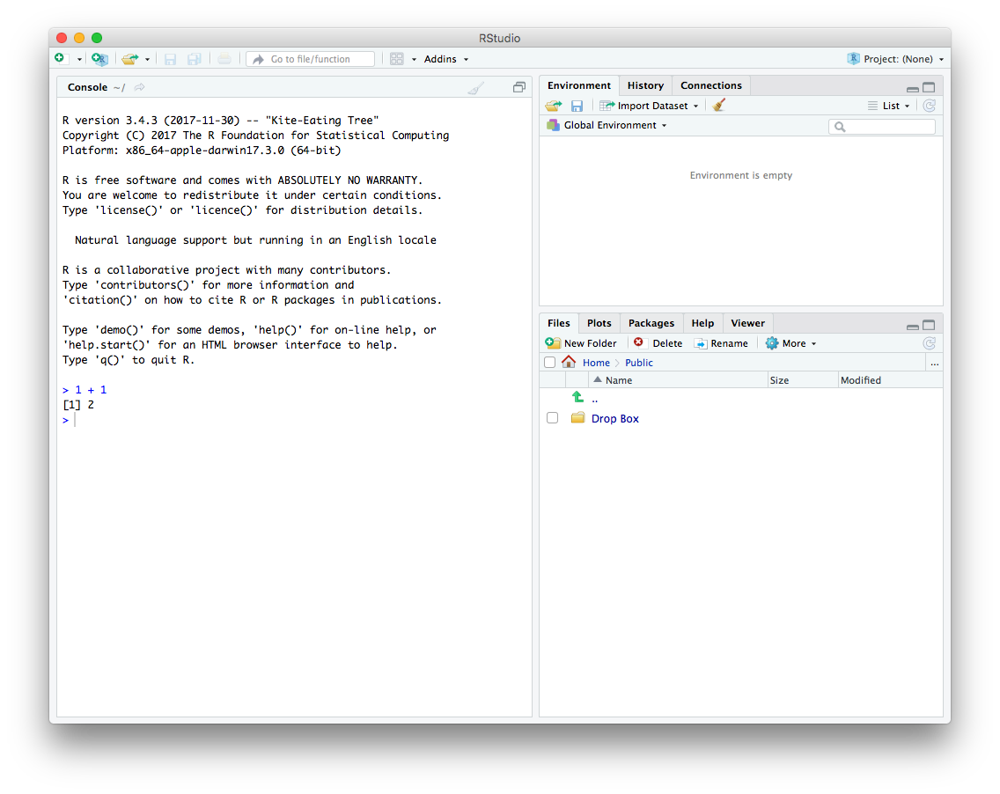

I've enrolled myself in the Duke University course [Statistics with R](https://www.coursera.org/specializations/statistics) on Coursera. This is a quick note around how I setup R and R-studio on MacOS Sierra and above.

**Step 1:** Install [Homebrew](https://brew.sh/) and [Cask](https://caskroom.github.io/). Homebrew is a package manager for MacOS and Cask allows you to install Apps using the Homebrew CLI.

```bash
/usr/bin/ruby -e "$(curl -fsSL https://raw.githubusercontent.com/Homebrew/install/master/install)"
brew tap caskroom/cask
```

**Step 2:** Install R, XQuartz and R Studio. You no longer have to tap the science homebrew repository to install R - it has been included in the standard repository since 2017.

```bash
brew install r
brew cask install xquartz rstudio
```


